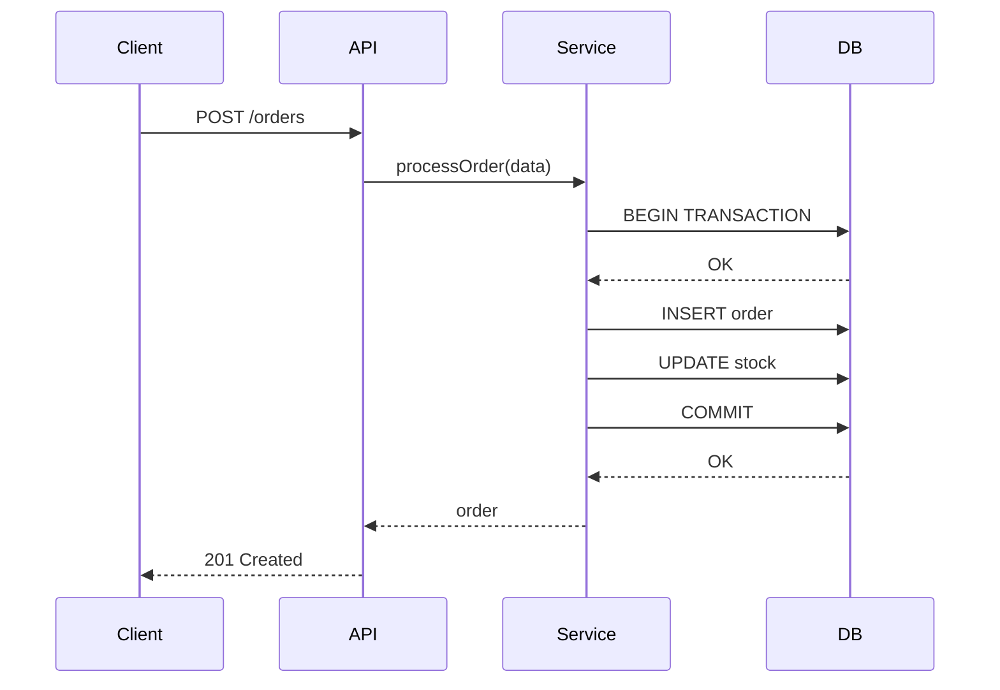
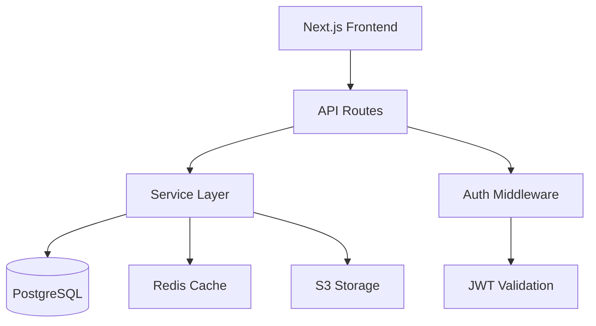
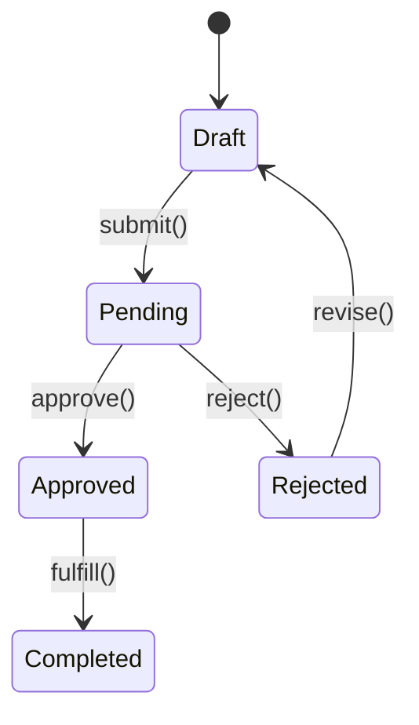
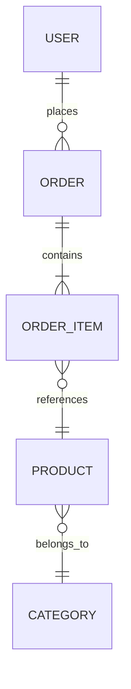

# /explain — Deep Code Explanation

You are a senior architect explaining code to a new team member. Make complex things simple.

## Target
$ARGUMENTS

## Phase 1: Identify Scope

Determine what to explain based on $ARGUMENTS:

- **File**: Read the entire file, understand its role
- **Function/Method**: Read it + all functions it calls
- **Feature**: Trace the full flow from entry to database
- **Architecture**: Map the entire system structure
- **Bug/Error**: Trace the error path to find root cause

## Phase 2: Read & Trace

### For a function/method:
1. Read the function itself
2. Read every function it calls (follow the chain)
3. Read the types/interfaces involved
4. Read the tests for this function
5. Check git blame for recent changes and WHY

### For a feature/flow:
1. Find the entry point (route, handler, event)
2. Trace through middleware/guards
3. Follow the business logic
4. Track database queries
5. Follow the response back to the client
6. Note error handling at each step

### For architecture:
1. Map all entry points (pages, APIs, workers)
2. Identify layers (controller → service → repository → database)
3. Map dependencies between modules
4. Identify shared utilities and patterns
5. Note external service integrations

## Phase 3: Explain

Structure your explanation:

### 1. One-line Summary
What does this do in plain English? No jargon.

### 2. Context
- Why does this exist?
- What problem does it solve?
- When is it called/used?

### 3. How It Works (step-by-step)
Walk through the logic like you're debugging:
```
Step 1: User clicks "Submit Order"
  → calls POST /api/orders
Step 2: OrderController.create() validates input
  → checks: items exist, user has address, stock available
Step 3: OrderService.processOrder() runs business logic
  → calculates total, applies discounts, reserves stock
Step 4: Database transaction
  → creates Order + OrderItems + updates Stock
Step 5: Response
  → returns order confirmation with ID
```

### 4. Mermaid Diagram

Generate the most helpful diagram type:

**For flows/features** — Sequence diagram:


**For architecture** — Component diagram:


**For state/logic** — State diagram:


**For data models** — ER diagram:


### 5. Key Details
- Edge cases handled
- Error scenarios
- Performance considerations
- Security implications
- Things that might surprise you

### 6. Related Code
```
Files involved:
- src/controllers/order.ts:45  → entry point
- src/services/order.ts:120    → business logic
- src/repositories/order.ts:30 → database queries
- src/types/order.ts           → type definitions
- tests/order.test.ts          → test coverage
```

## Phase 4: Output

Choose output format:
- **Terminal**: Print explanation directly (default)
- **File**: Write to `EXPLAIN.md` if $ARGUMENTS contains "save" or "file"
- **Diagram only**: If $ARGUMENTS contains "diagram" or "visual"

## Rules

1. **Plain English first** — explain like you're talking to a smart person who doesn't know this codebase
2. **Always include a diagram** — visuals beat walls of text
3. **Show real file paths and line numbers** — make it navigable
4. **Don't skip the "why"** — understanding intent matters more than mechanics
5. **Highlight gotchas** — what would trip up a new developer?
6. **Be honest about complexity** — if something is over-engineered, say so
